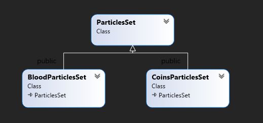

# "Chest hunter"
## Description
2D Platformer written on C++ with SFML and a bit of OpenGL.
The game has build-in maps(campaign) which you can't change and section with custom maps where are saved you own maps.
## Basic game abilities
### 1. Common data and functions storage
"GameData" struct provides access to asset and input managers, state machine, particles system and whole window. 
"GameDataRef" is a pointer that allows to aggregate "GameData" and easily pass it to each class it is needed.

### 2. State machine
Consists of "StateMachine" class that controls state switching, removing, adding.Based on a stack. 
 
"State" is an abstract class that provides an interface for all specific states classes.

### 3. Managers
"AssetManager" allows to load fonts, textures, sounds into RAM and access them whenever you want while tha game is running.
"InputManager" allows to check user input events, for example is sprite/rect clicked, is mouse in rect etc.
Many of these functions are overloaded to handle events relatively to some objects or taking into account camera position/scale.
### 4. Particles system
"ParticlesSystem" class has vector with pointers to all particles set which are currently updating and displaying on a map. Also there are 3 methods that: adds new particles set to vector, updates all sets in vector, draws all sets from vector. Particles are drawed directly in the window and for this is used OpenGL (more efficient than drawing from SFML). Since SFML is built on OpenGL after each drawing is used resetGLStates() method to avoid conflicts with drawing. 
"Particle" class objects store data of one particle(mass, position, speed, forces)

 
"ParticlesSet" is an abstract class that stores common data and methods. Due to polimorphism objects of classes like "BloodParticlesSet", "CoinsParticlesSet" which override "ParticlesSet" can be stored in one data structure and this simplifies drawing and updating. 
 
Moreover, particles update is computing in different thread because of process complexity.
## High-level stuff
### 1. Map
In "BaseMap" implemented frequently used methods like tiles texture changing, map blocks initialization, map canvas redrawing and main map data structures.
"Tilemap" is used in in game state and "TileMapEditor" for editing and creating your own maps. State machine allows rapidly switch this modes for example when you want to test your map and don't leave editor mode. 

### 2. Player
"Player" is responsible for sprite drawing, information bar, inventory, victory/gameover check, player animations. It aggregates "InfoBar", "Inventory".
"Player" is derived from "Entity", because "Entity" implements physics, collision check. 

### 3. Trigger system
With collison is also checked tile trigger(if there is one). Player could press "X" button which could trigger some action. For example when you open chest or open door with key in your inventory. "TriggerReact" is a class for temporary created object which contains trigger information. "TriggerReact" is taking trigger coordinates, time offset from start, duration, number of frames to animate.
## Release
Release on itch.io : https://makarenk0.itch.io/chest-hunter  
Android porting soon.
